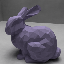
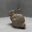
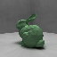
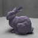
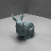
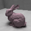
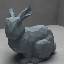
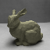

# Stanford Bunny Dataset

This dataset contains path traced images of a modified version of the *Stanford Bunny* model with 850 verticies downscaled using Blender. As these images portray the *Stanford Bunny*, provided by the [Stanford Computer Graphics Laboratory](https://graphics.stanford.edu/), use of this dataset *must follow* the guidelines regarding the model file specified [here](https://graphics.stanford.edu/data/3Dscanrep/). If used in projects aligning with the specified guidelines, full credit for the dataset images is to be given to the [Stanford Computer Graphics Laboratory](https://graphics.stanford.edu/).

## Content

The following are eight randomly selected example images from the dataset:

       

## Structure

The dataset contains one large zipped folder named `64` with 9000 images of dimensions `64x64` pixels. The second zipped folder is named `64t` and contains a few extra images of the same dimensions that can be used for things like testing performance of an artificial neural network.
